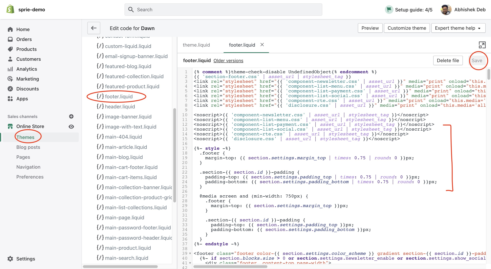
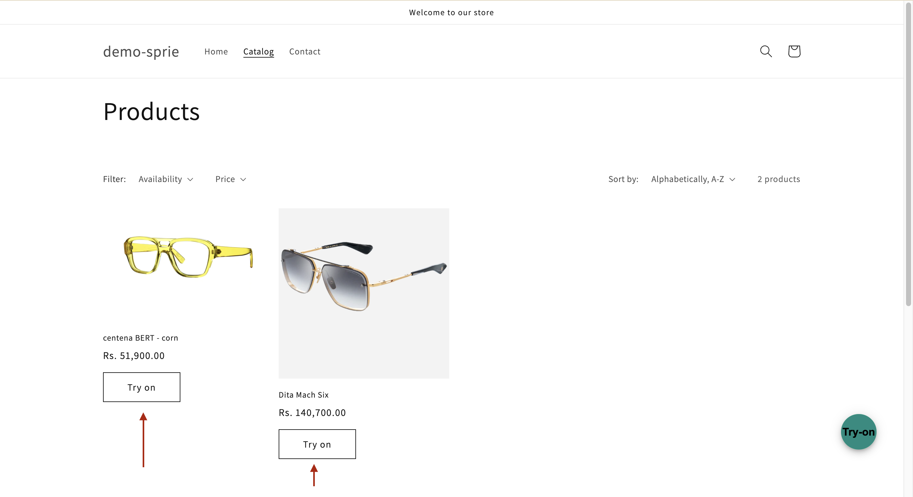

Shopify is an eCommerce website to sell, ship, and process payments. All the activities in Sprie happen in front end. What we can do is break the typical Sprie Workflow into several `liquid` files so that they all take care of specific actions on specific intents.

**Note:** This page is designed to be used as a reference for the Shopify implementation. The code below uses outdated Liquid v1, but can be adapted for the Liquid v2. This page will be updated soon with Liquid v2.

## Summary

- [Summary](#summary)
- [Implementation](#implementation)
  - [Initialise](#initialise)
  - [Add TryOn Button](#add-tryon-button)
  - [Check SKU Registration](#check-sku-registration)
  - [Handle Add to Cart](#handle-add-to-cart)
  - [Handle Variants changes](#handle-variants-changes)
  - [Show on Collections Page](#show-on-collections-page)
- [Full Reference Code](#full-reference-code)

## Implementation

All the implementation work requires you to edit `.liquid` files, right off the admin editor:

1. Go to `<your-shopify-store>/admin` page and login (`https://mystore.myshopify.com/admin`)
2. `Online Store > Themes > Actions > Edit Code`
3. Select file from left Column, Edit/update/insert the code and click on `Save` on top right.



### Initialise

We would want to initialise Sprie Widget in a place where that particular part of html gets rendered on every single page.
'footer.liquid' is a very good way to start initialising the widget.
Insert the follwing code in `sections > footer.liquid` file :

```HTML
<!-- Sprie -->
<script src="https://cdn.jsdelivr.net/npm/@perceptimagery/sprie-widget@latest?apikey={apikey}"></script>
```

### Add TryOn Button

The `Preview` TryOn Button should be available where the main product is displayed (PDP - Product Display Page).
Head on to `sections > main-product.liquid` and put the following code around line number `440` buy buttons in  `product-form__buttons` element :

```HTML
<button
 id="tryon-button"
 type="button"
 name="tryon"
 style="display:none" 
 onclick="SprieSDK.Load(currentVariantSku)"
 class="product-form__submit button button--full-width button--secondary"
>
 <span> Try on </span>
</button>

```

We will add `currentVariantSku` variable in the following steps.


### Check SKU Registration

Sprie authentication happens under the hood with the api key provided, and its an asynchronous task. Sprie exposes certain [events](https://docs.sprie.io/docs/events) to let the developers know when certain actions happen, and how to listen to them.  
In this case, we tap on to `onSDKReady` event to know when the authentication is done and Sprie is ready for use. Put the below code in the same `sections > footer.liquid` file after the above step.

```JS
// Check SKU is registered
function CheckSKU(){
 // Check product registration if inside product page
 if(currentVariantSku && tryonButton){
 tryonButton.style.display = "none";
  SprieSDK.CheckSKU(currentVariantSku).then(checkResult=>{
  tryonButton.style.display = checkResult[productSku]?"block":"none";
  });
 }
}

// Check with server if product is registered
document.addEventListener("SprieEvent:onSDKReady", function(e){
 CheckSKU();
}); 

```

Here, we are listening to `onSDKReady` event, then checking of productSku is not null, and then using [Sprie Methods](https://docs.sprie.io/docs/methods) to check product registration with Sprie. Once the result is received, we immeidtaely show/hide the tryon button that we created in step 2.

### Handle Add to Cart

Sprie offers a Add to Cart CTA on the widget which dispatches an event with the specific product SKU. You can listen to the event and decide the action on the received event. The reason we do not provide any backend action is because Sprie doesn't interfere with the framework you are using and leaves it up to you to decide how you want to implement it.

As an example, in Shopify setup, you can add it to card in the following way :

```JS
// Handle Add to Cart
function AddToCart (e){
  console.log('Added to cart: ',e.detail );
    const url = `${window.Shopify.routes.root}cart/add.js`;
    const itemToAdd = Object.keys(variantIdSkuMap).find(x=>variantIdSkuMap[x]===currentVariantSku);
    const cartBody = {
      items: [
        {
          id: itemToAdd,
          quantity: 1
        }
      ]
    }

  if(!itemToAdd) return;

    fetch(url, {
      method: 'POST',
      headers: {
        'Accept': 'application/json, text/plain, */*',
        'Content-Type': 'application/json'
      },
      body: JSON.stringify(cartBody)
    }).then(res => res.json())
      .then(res => console.log(res));
  }
 document.addEventListener("SprieEvent:onAssetCart", (e)=>{
    AddToCart(e);
  });
```

This particular code uses `onAssetCart` event from Sprie to POST to `/wp-json/wc/store/cart/add-item` api from woo commerce to add the item to cart usig jQuery's `ajax` method, which is by default installed in a wordpress setup.

### Handle Variants changes

in `sections> footer.liquid`, put this code after the previous step:

```JS
// Handle Variant Change
function onVariantChange(event) {
 console.log('Checked radio with ID = ' + event.target.getAttribute('data-sku'));
 currentVariantSku=event.target.getAttribute('data-sku');
 CheckSKU();
}

const variantElements= document.querySelectorAll('input[name="Color"]');
console.log({variantElements});
variantElements.forEach((input) => {
 let selectedVariant = currentProduct.variants.find(variant => variant.name === input.value || variant.option1 === input.value);
 input.setAttribute('data-sku', selectedVariant.sku || productSku);
 input.addEventListener('change', onVariantChange);
});
```

We check for radio button clicks and run `CheckSKU` on them and enable the Preview `TryOn` button accordingly.

### Show on Collections Page

To show Try On Button multiple times with each product card, we can use `CheckSKUBatch` method of Sprie to check mulitple SKUs at once, thus removing redundant API calls to Sprie.
The end result of this section looks like the image below :



How do we do it?  
This required editing two files,

1. In `snippets > card-product.liquid`, add the following code arounf Line Number 147 inside `.card__information` class div. :

```HTML
 <button
    id="tryon-button"
    type="button"
    name="tryon"
    data-sku="{{ card_product.handle }}"
    style="display:none; margin-top:1em;"
    class="button-sprie-tryon button button--small button--secondary"
    onclick="SprieSDK.Load('{{card_product.handle}}')"  
    >  Try on 
</button>
```

We simple hide the button initially so that later on we can check for the SKU registration and enable it accordingly, in the following step :

2.`sections > main-collection-product-grid.liquid`, append the following JS code at bottom :

```HTML
<script>
  const sprieBtn = document.querySelectorAll('.button-sprie-tryon');
  const products={{ collection.products | json }} 
  const productSKUs=products.map(x=>x.handle);

  function StartSKUCheck(){
    console.log('Checking Batch ...');
    SprieSDK.CheckSKUBatch([...productSKUs, 'sample-non-existant-sku'])
    .then(function (result){
      sprieBtn.forEach(btn=>{
        btn.style.display=result[btn.getAttribute('data-sku')]?'block':'none';
      });
    });
  }
  document.addEventListener('SprieEvent:onSDKReady',  StartSKUCheck);
</script>
```

Here, we are listening for `onSDKReady` event of Sprie and then using Shopify liquid variable `{{ collection.products | json }}` to get the product list and running `CheckSKUBatch` on the SKUs and setting the tryon button to visible accordingly. This can be replicated to Homepage as well.

## Full Reference Code

Code in `sections> footer.liquid` :

```HTML
<!-- Sprie -->
<script src="https://cdn.jsdelivr.net/npm/@perceptimagery/sprie-widget@latest?apikey={apikey}"></script>
<script>

  // Utilities
  const params = new Proxy(new URLSearchParams(window.location.search), {
    get: (searchParams, prop) => searchParams.get(prop),
  });

 // Fetch Product Specific Data
 const urlPath = window.location.pathname;
 const productSku = urlPath.indexOf('products/')>=0 ? urlPath.replace('products','').replaceAll('/','').trim() : '';
  const currentVariantId = params.variant || null;
  const currentProduct= {{ product | json }};
  const variantIdSkuMap= !!currentProduct  ? currentProduct.variants.reduce((acc,curr)=>{      
    acc[curr.id]=curr.sku || productSku;
    return acc;
  },{}): {};
  let currentVariantSku = variantIdSkuMap[currentVariantId] || productSku || null;
  const tryonButton = document.getElementById('tryon-button');

  // Check SKU is registered
  function CheckSKU(){
  // Check product registration if inside product page
    if(currentVariantSku && tryonButton){
      tryonButton.style.display = "none";
   SprieSDK.CheckSKU(currentVariantSku).then(checkResult=>{
         tryonButton.style.display = checkResult[productSku]?"block":"none";
   });
  }
  }
  // Check with server if product is registered
  document.addEventListener("SprieEvent:onSDKReady", function(e){
  CheckSKU();
  }); 

 // Handle Add to Cart
 function AddToCart (e){
  console.log('Added to cart: ',e.detail );
    const url = `${window.Shopify.routes.root}cart/add.js`;
    const itemToAdd = Object.keys(variantIdSkuMap).find(x=>variantIdSkuMap[x]===currentVariantSku);
    const cartBody = {
      items: [
        {
          id: itemToAdd,
          quantity: 1
        }
      ]
    }

  if(!itemToAdd) return;

    fetch(url, {
      method: 'POST',
      headers: {
        'Accept': 'application/json, text/plain, */*',
        'Content-Type': 'application/json'
      },
      body: JSON.stringify(cartBody)
    }).then(res => res.json())
      .then(res => console.log(res));
  }
 document.addEventListener("SprieEvent:onAssetCart", (e)=>{
    AddToCart(e);
  });

  // Handle Variant Change
  function onVariantChange(event) {
      console.log('Checked radio with ID = ' + event.target.getAttribute('data-sku'));
      currentVariantSku=event.target.getAttribute('data-sku');
      CheckSKU();
  }

  const variantElements= document.querySelectorAll('input[name="Color"]');
  console.log({variantElements});
  variantElements.forEach((input) => {
      let selectedVariant = currentProduct.variants.find(variant => variant.name === input.value || variant.option1 === input.value);
      input.setAttribute('data-sku', selectedVariant.sku || productSku);
      input.addEventListener('change', onVariantChange);
  });
</script>

```

`sections > main-product.liquid` :

```HTML
<button
 id="tryon-button"
 type="button"
 name="tryon"
 style="display:none" 
 onclick="SprieSDK.Load(currentVariantSku)"
 class="product-form__submit button button--full-width button--secondary"
 >
 <span>
  Try on
 </span>
</button>

```
