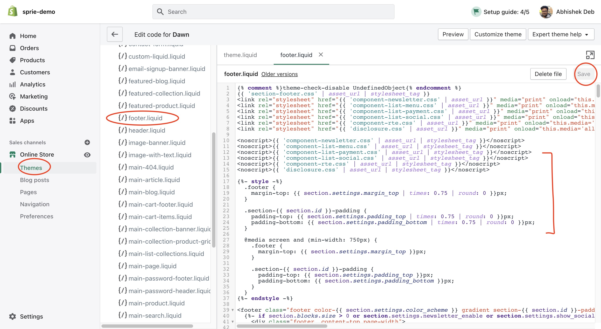
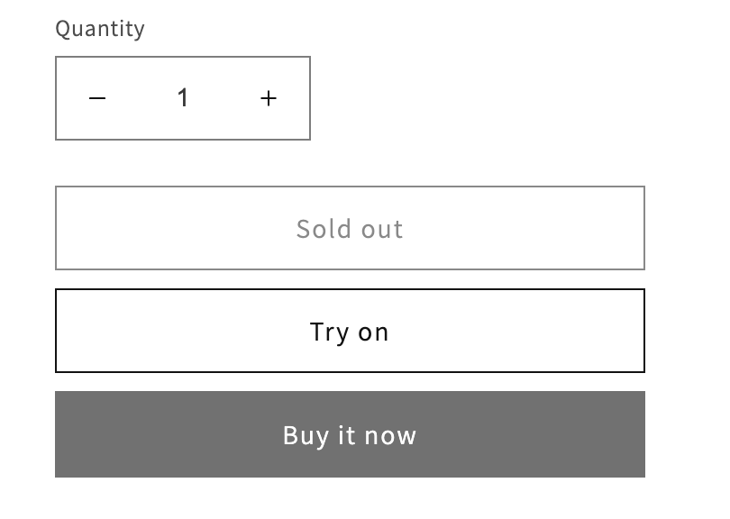

## Demo
Demo Link : `https://demo-sprie.myshopify.com/products/centena-bert-corn?variant=42471361609891`  
Password : `password` 
Shopify App : Comming soon!

Shopify is an eCommerce website to sell, ship, and process payments. All the activities in Sprie happen in front end. What we can do is break the typical Sprie Workflow into several `liquid` files so that they all take care of specific actions on specific intents.

## Summary
1. Initialise Sprie Widget at a common place
2. Add Preview Button
3. Translate skus from objects ids
4. check SKU Registration
5. Add to Cart
6. Handle Variants changes
7. Next Steps
8. Full Code


## Implementation
All the implementation work requires you to edit `.liquid` files, right off the admin editor:
1. Go to `<your-shopify-store>/admin` page and login (`https://mystore.myshopify.com/admin`)
2. `Online Store > Themes > Actions > Edit Code`
3. Select file from left Column, Edit/update/insert the code and click on `Save` on top right.



### 1. Initialise
We would want to initialise Sprie Widget in a place where that particular part of html gets rendered on every single page.
'footer.liquid' is a very good way to start initialising the widget. 
Insert the follwing code in `sections > footer.liquid` file : 
```HTML
<!-- Sprie -->
<script src="https://cdn.jsdelivr.net/npm/@perceptimagery/sprie-widget@latest"></script>
<div id="sdk-widget" data-apikey="<your api key>"></div>
```

### 2. Add TryOn Button
The `Preview` TryOn Button should be available where the main product is displayed (PDP - Product Display Page).
Head on to `sections > main-product.liquid` and put the following code around line number `440` buy buttons in  `product-form__buttons` element : 

```HTML
<button
	id="tryon-button"
	type="button"
	name="tryon"
	style="display:none" 
	onclick="SprieSDK.Load(currentVariantSku)"
	class="product-form__submit button button--full-width button--secondary"
>
	<span> 	Try on </span>
</button>

```
We will add `currentVariantSku` variable in the following steps.



### 3. Setup SKU Translation
We need a way to send the skus to the `Load` method of the widget to show it properly. Most often times, the SKUs are pre-registered during asset onboard process with Sprie. To acquire the proper skus:
1. Either it can be generated uniquely and sent over to Sprie in a CSV,  
2. or, just use the url param of a current item in a PDP ( Product Display Page).

To use the url-param as sku, we would need to translate the `url` into an `sku`. Write the following code in `sections > footer.liquid` file after you have initialised Sprie Widget : 

```HTML
<script>
	const params = new Proxy(new URLSearchParams(window.location.search), {
		get: (searchParams, prop) => searchParams.get(prop),
	});

	// Fetch Product Specific Data
	const urlPath = window.location.pathname;
	const productSku = urlPath.indexOf('products/')>=0 ? urlPath.replace('products','').replaceAll('/','').trim() : '';
  	const currentVariantId = params.variant || null;
  	const currentProduct= {{ product | json }};
	const variantIdSkuMap= !!currentProduct  ? currentProduct.variants.reduce( (acc,curr)=>{      
			acc[curr.id]=curr.sku || productSku;
			return acc;
		},{}): {};
  	let currentVariantSku = variantIdSkuMap[currentVariantId] || productSku || null;
  	const tryonButton = document.getElementById('tryon-button');
</script>

```
What we are essentially doing here is stripping the url param path, using Shopify API to get current product and/or variant and setting up `currentVariantSku`. If this value is not null, we can Load Sprie on click handler, or do a check with Sprie Network.


### 4. Check SKU Registration
From the above step, we get a sku for a specific product which we want to run through Sprie Check. Now Sprie authentication happens under the hood with the api key provided, and its a asynchronous task. Sprie exposes certain [events](https://docs.sprie.io/docs/events) to let the developers know when certain actions happen, and how to listen to them.  
In this case, we tap on to `onSDKReady` event to know when the authentication is done and Sprie is ready for use. Put the below code in the same `sections > footer.liquid` file after the above step.

```JS
// Check SKU is registered
function CheckSKU(){
	// Check product registration if inside product page
	if(currentVariantSku && tryonButton){
	tryonButton.style.display = "none";
		SprieSDK.CheckSKU(currentVariantSku).then(checkResult=>{
		tryonButton.style.display = checkResult[productSku]?"block":"none";
		});
	}
}

// Check with server if product is registered
document.addEventListener("SprieEvent:onSDKReady", function(e){
	CheckSKU();
}); 

```

Here, we are listening to `onSDKReady` event, then checking of productSku is not null, and then using [Sprie Methods](https://docs.sprie.io/docs/methods) to check product registration with Sprie. Once the result is received, we immeidtaely show/hide the tryon button that we created in step 2.


### 5. Handle Add to Cart
Sprie offers a Add to Cart CTA on the widget which raises an event with the specific product SKU. You can listen to the event and decide what to do with the Event itself. The reason we do not provide any backend action is because Sprie simply doesn't depende/ bother the frameowkr you are working on and leaves it upto you to decide how you want to implement it.
As an example, in Wordpress + Woocommerce setup, you can add it to card in the following way : 

```JS
// Handle Add to Cart
document.addEventListener("SprieEvent:onAssetCart", (e)=>{
	console.log('Added to cart: ',e.detail );
});

```

This particular code uses `onAssetCart` event from Sprie to POST to `/wp-json/wc/store/cart/add-item` api from woo commerce to add the item to cart usig jQuery's `ajax` method, which is by default installed in a wordpress setup.


### 6. Handle Variants changes

in `sections> footer.liquid`, put this code after the previous step:
```JS
// Handle Variant Change
function onVariantChange(event) {
	console.log('Checked radio with ID = ' + event.target.getAttribute('data-sku'));
	currentVariantSku=event.target.getAttribute('data-sku');
	CheckSKU();
}

const variantElements= document.querySelectorAll('input[name="Color"]');
console.log({variantElements});
variantElements.forEach((input) => {
	let selectedVariant = currentProduct.variants.find(variant => variant.name === input.value || variant.option1 === input.value);
	input.setAttribute('data-sku', selectedVariant.sku || productSku);
	input.addEventListener('change', onVariantChange);
});
```
We check for radio button clicks and run `CheckSKU` on them and enable the Preview `TryOn` button accordingly.

### 7. Next Steps
We are in the process of creatign a plugin which will do all these on your behalf. Once we have completely tested the code, we will announce it and let you know.

### 8. Full Code

Code in `sections> footer.liquid` :

```HTML
<!-- Sprie -->
<script src="https://cdn.jsdelivr.net/npm/@perceptimagery/sprie-widget@latest"></script>
<div id="sdk-widget" data-apikey="579e87f3b327061b39"></div>
<script>

  // Utilities
  const params = new Proxy(new URLSearchParams(window.location.search), {
    get: (searchParams, prop) => searchParams.get(prop),
  });

	// Fetch Product Specific Data
	const urlPath = window.location.pathname;
	const productSku = urlPath.indexOf('products/')>=0 ? urlPath.replace('products','').replaceAll('/','').trim() : '';
  const currentVariantId = params.variant || null;
  const currentProduct= {{ product | json }};
  const variantIdSkuMap= !!currentProduct  ? currentProduct.variants.reduce((acc,curr)=>{      
    acc[curr.id]=curr.sku || productSku;
    return acc;
  },{}): {};
  let currentVariantSku = variantIdSkuMap[currentVariantId] || productSku || null;
  const tryonButton = document.getElementById('tryon-button');

  // Check SKU is registered
  function CheckSKU(){
		// Check product registration if inside product page
    if(currentVariantSku && tryonButton){
      tryonButton.style.display = "none";
			SprieSDK.CheckSKU(currentVariantSku).then(checkResult=>{
         tryonButton.style.display = checkResult[productSku]?"block":"none";
			});
		}
  }
  // Check with server if product is registered
  document.addEventListener("SprieEvent:onSDKReady", function(e){
		CheckSKU();
  }); 

	// Handle Add to Cart
	document.addEventListener("SprieEvent:onAssetCart", (e)=>{
		console.log('Added to cart: ',e.detail );
	});

  // Handle Variant Change
  function onVariantChange(event) {
      console.log('Checked radio with ID = ' + event.target.getAttribute('data-sku'));
      currentVariantSku=event.target.getAttribute('data-sku');
      CheckSKU();
  }

  const variantElements= document.querySelectorAll('input[name="Color"]');
  console.log({variantElements});
  variantElements.forEach((input) => {
      let selectedVariant = currentProduct.variants.find(variant => variant.name === input.value || variant.option1 === input.value);
      input.setAttribute('data-sku', selectedVariant.sku || productSku);
      input.addEventListener('change', onVariantChange);
  });
</script>

```

`sections > main-product.liquid` : 
```HTML
<button
	id="tryon-button"
	type="button"
	name="tryon"
	style="display:none" 
	onclick="SprieSDK.Load(currentVariantSku)"
	class="product-form__submit button button--full-width button--secondary"
	>
	<span>
		Try on
	</span>
</button>

```